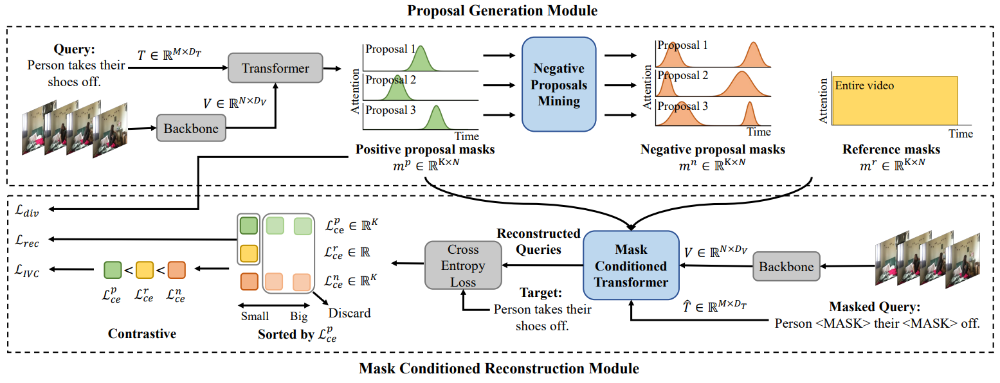

# CPL: Weakly Supervised Temporal Sentence Grounding with Gaussian-based Contrastive Proposal Learning

In this paper, we propose Contrastive ProposalLearning (CPL) for the weakly supervised temporal sentence grounding task. We use multiple learnable Gaussian functions to generate both positive and negative proposals within the same
video that can characterize the multiple events in a long video. Then, we propose a controllable easy to hard negative proposal mining strategy to collect negative samples within the same video, which can ease the model optimization and enables CPL to distinguish highly confusing scenes. The experiments show that our method achieves state-of-the-art performance on Charades-STA and ActivityNet Captions datasets.

Our paper was accepted by CVPR-2022. [[Paper](https://minghangz.github.io/uploads/CPL/CPL_paper.pdf)] [[Project Page](https://minghangz.github.io/publication/cpl/)]

## Pipeline



## Main Results

### Charades-STA Dataset


| Method  | Rank1@0.3 | Rank1@0.5 | Rank1@0.7 | Rank5@0.3 | Rank5@0.5 | Rank5@0.7 |
| :-----: | :-------: | :-------: | :-------: | :-------: | :-------: | :-------: |
|   CPL   |   66.40   |   49.24   |   22.39   |   96.99   |   84.71   |   52.37   |
| CPL$^*$ |   65.99   |   49.05   |   22.61   |   96.99   |   84.71   |   52.37   |

Our trained model can be downloaded from [here](checkpoints/charades/model-best.pt)

### ActivityNet Captions Dataset

| Method  | Rank1@0.1 | Rank1@0.3 | Rank1@0.5 | Rank5@0.1 | Rank5@0.3 | Rank5@0.5 |
| :-----: | :-------: | :-------: | :-------: | :-------: | :-------: | :-------: |
|   CPL   |   79.86   |   53.67   |   31.24   |   87.24   |   63.05   |   43.13   |
| CPL$^*$ |   82.55   |   55.73   |   31.37   |   87.24   |   63.05   |   43.13   |

Our trained model can be downloaded from [here](checkpoints/activitynet/model-best.pt)

If you can not reproduce the results with the configuration file, please try to adjust the hyperparameter lambda (e.g. from 0.125 to 0.135) in the configuration file, as in our experiments we found that the model is more sensitive to this hyperparameter.

## Requiments

- pytorch
- h5py
- nltk
- fairseq

## Quick Start

### Data Preparation

We use the C3D feature for the ActivityNet Captions dataset. Please download from [here](http://activity-net.org/challenges/2016/download.html) and save as `data/activitynet/c3d_features.hdf5`. We use the I3D feature provided by [LGI](https://github.com/JonghwanMun/LGI4temporalgrounding) and use [this script](/data/convert_npy_to_hdf5.py) to convert the file format to HDF5. We also provide the converted I3D feature for the Charades-STA dataset, and can be downloaded from [here](https://pan.baidu.com/s/1WhWreaHIx8pI5hLK2uyCdw?pwd=4g9h). We expect the directory structure to be the following:

```
data
├── activitynet
│   ├── sub_activitynet_v1-3.c3d.hdf5
│   ├── glove.pkl
│   ├── train_data.json
│   ├── val_data.json
│   ├── test_data.json
├── charades
│   ├── i3d_features.hdf5
│   ├── glove.pkl
│   ├── train.json
│   ├── test.json
```


### Training

To train on the ActivityNet Captions dataset:
```bash
python train.py --config-path config/activitynet/main.json --log_dir LOG_DIR --tag TAG
```

To train on the Charades-STA dataset:
```bash
python train.py --config-path config/charades/main.json --log_dir LOG_DIR --tag TAG
```

Use `--log_dir` to specify the directory where the logs are saved, and use `--tag` to identify each experiment. They are both optional.

The model weights are saved in `checkpoints/` by default and can be modified in the configuration file.

### Inference

Our trained model are provided in [`checkpoints/`](/checkpoints/). Run the following commands for evaluation:

```bash
# Use loss-based strategy during inference
python train.py --config-path CONFIG_FILE --resume CHECKPOINT_FILE --eval
# Use vote-based strategy during inference
python train.py --config-path CONFIG_FILE --resume CHECKPOINT_FILE --eval --vote
```

The configuration file is the same as training.
